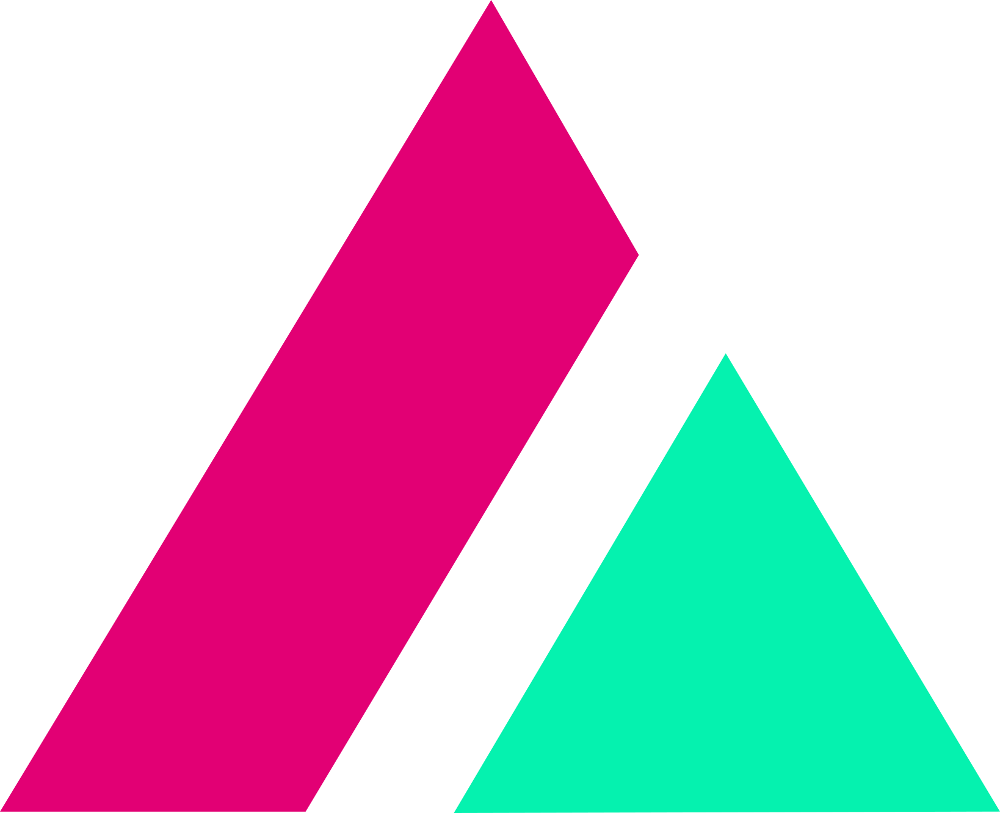

# theProject

> *No seriously, our company **is** “theProject,” and this is our homebase!*

---

## Mission & Values

**theProject** is tech evangelism with humility — a place for the *imposters with good intent*.  
We build, learn, and share in public so others can level-up with us.

On our blog you’ll find:

- 🎮 **Game Development** — behind-the-scenes on our in-house titles  
- 💻 **Web Dev & Industry** — opinions and deep dives on modern stacks  
- 🤖 **AGI / AI Frontier** — bold discussions as we race toward artificial general intelligence  
- 🚀 **Frontier Innovation** — risky experiments and lessons learned  

Whether you’re a curious newbie or a seasoned pro, you’ve got a seat at our table.

---

## ⚙️  Tech Stack

| Layer      | What we use | Links |
| ---------- | ----------- | ----- |
| Front-end  | **Next.js 15.3.2+** / **React 19.1+** | [Next.js](https://nextjs.org) · [React](https://react.dev) |
| Language   | **TypeScript** | [TypeScript](https://www.typescriptlang.org) |
| Styling    | **Tailwind CSS 4.1.5+** | [Tailwind](https://tailwindcss.com) |
| CMS        | **Payload CMS 3.38+** | [Payload CMS](https://payloadcms.com) |
| Data       | **Neon Postgres** | [Neon](https://neon.tech) |
| Storage    | **Vercel Blob** | [Vercel Blob](https://vercel.com/storage/blob) |
| Hosting    | **Vercel** | [Vercel](https://vercel.com) |

> 💡 **Palette call-out:** brand magenta `#e20074` & mint `#0af59f` appear in our SVGs and UI.

---

## 📣  Join the Community

- **Subscribe** to the blog at [bytheproject.com](https://bytheproject.com).  
- **Comment** with feedback or ideas.  
- **Partner** with us on a project or consultation.  

Thank you for being part of the ride!

---

## 🤝  For Our Dev Friends

Curious how the sausage gets made? We push the **bleeding edge** on purpose:

- *Why Next 15 & React 19?* — App Router + the new React compiler goodness  
- *Why Tailwind 4?* — lightning-fast builds & modern design tokens  
- *Why Payload?* — self-hosted TypeScript CMS with powerful blocks  
- *Why Neon?* — serverless Postgres without cold-start pain  
- *Why Vercel Blob?* — zero-config object storage on the same edge network  

We share real stories: from “it just shipped” wins to “wow that bug hurt” post-mortems.  
Hack on a similar stack? Open an issue or PR — let’s learn together.

---

*Teaser art for an upcoming blog series… stay tuned!*

---

### Asset Notes

1. Place your SVGs in an `assets/` folder (or adjust the paths above).  
2. GitHub renders SVGs natively, so no extra steps needed.  

Enjoy — and welcome to **theProject**!
